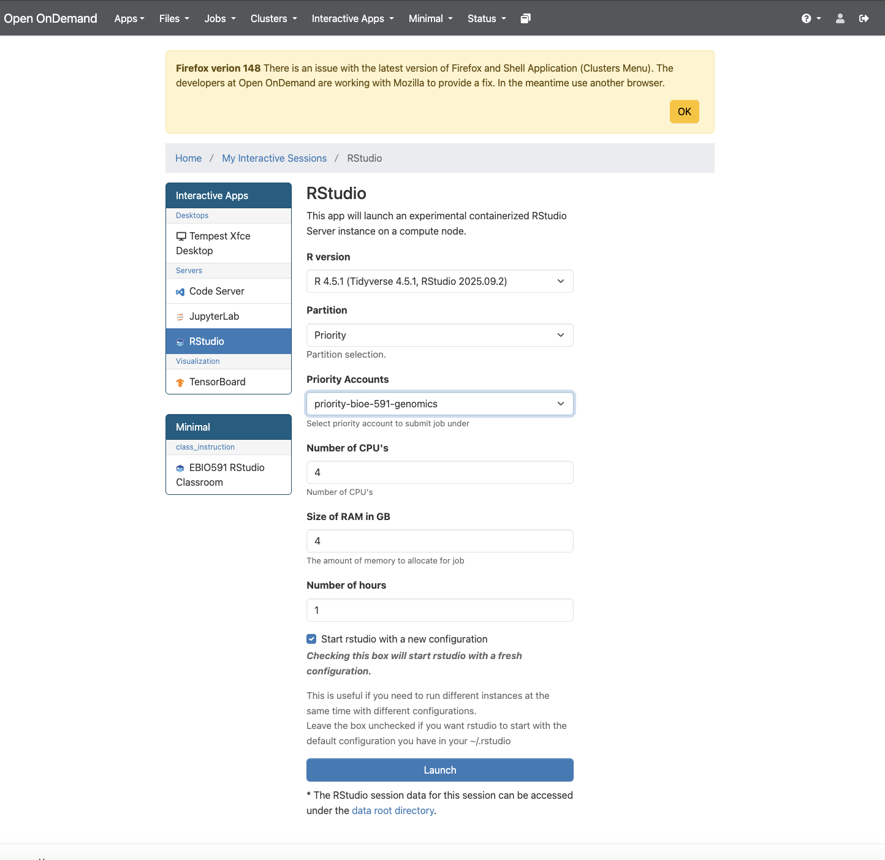

## Calculating Kinship Coefficients

For the remainder of the semester we will transition from assembling genomic data and calling variants to analyzing these data to answer biological questions. Doing so will involve the continued use of command-line programs and `.sbatch` scripts but add the use of the `R` programming language and several packages developed for population genomics adn data visualization. Today's lab involves a bit of both, calculating kinship coefficients for empirical data from [Hauser et al. 2022](https://doi.org/10.1111/1755-0998.13630) using multiple methods. You will recall their study assessed consistency of kinship estimates from both reduced representation and whole genome sequence data across a range of taxa. As is customary on publication, the authors deposited `.vcf` files in the [`Dryad`](https://doi.org/10.5061/dryad.3n5tb2rkp) archive; I have downloaded to our class directory for your use (`~/bioe-591-genomes/course-materials/data/kinship/`). To begin, choose a single dataset to use in the following tutorials. (As usual, you will not be able to write in this directory, so remember to change output file paths or copy a `.vcf` into your own subdirectory. )  

### Working with `ngsRelate`

The first tool we will use is the command-line program [`ngsRelate`](https://github.com/angsd/ngsrelate), part of the [`ANGSD`](https://www.popgen.dk/angsd/index.php/ANGSD) ecosystem of methods for working with low-coverage sequence data. Importantly, `ngsRelate` can work directly from genotype likelihoods, incorporating uncertainty in variants into downstream estimates. However, it can also take a `.vcf` file with hard-called genotypes; we will follow Hauser et al. in doing so below. 

As usually, `ngsRelate` can be installed via `Mamba` and the `bioconda` channel:

```bash
name: ngsrelate
channels:
  - conda-forge
  - bioconda
dependencies:
  - ngsrelate
  - bcftools
  - htslib
```
```bash
mamba env create -f ngsrelate.yaml
```

Once you have done so and confirmed the installation was successful with command `ngsRelate`, create an `.sbatch` script with the usual header information and module / `Mamba` initialization, updated for a new job name. You will also need to use `tabix` (from `htslib`) to index the `.vcf` file and `bcftools query` to extract sample IDs; compressing it with `gzip` is also a good idea. Following those commands, `ngsRelate` can be run in a single line: 

```bash
#SBATCH --account=priority-bioe-591-genomics        
#SBATCH --job-name=ngsrelate                            
#SBATCH --partition=priority              
#SBATCH --nodes=1                       
#SBATCH --ntasks-per-node=1             
#SBATCH --cpus-per-task=1              
#SBATCH --time=0-10:00:00                 
#SBATCH --output=ngsrelate-%j.out
#SBATCH --error=ngsrelate-%j.err

module load Mamba/23.11.0-0;
eval "$(conda shell.bash hook)"

# gzip the vcf
bcftools view -Oz -o sample.vcf.gz sample.recode.vcf

# index the vcf
tabix -p vcf sample.vcf.gz

# generate a sample ID file 
bcftools query -l sample.vcf.gz > sample_ids.txt

# call ngsRelate
ngsRelate -h sample.vcf.gz -T GT -c 1 -O sample.ngsrelate.out -z sample_ids.txt
```

Above, the flag `-h` indicates an input `.vcf`, `-T` instructs the program to use genotypes instead of Phred-scaled likelihoods (e.g., data under the `PL` column of a `.vcf`, which are often absent), `-c` specifies the number of cores needed, `-O` is the path for an output file, and `-z` inputs the list of sample IDs created by `bcftools query`. Run the script with `sbatch`. Even using a single core, the analysis should complete in a manner of minutes. Examine `sample.ngsrelate.out` using `head`. You should see something like the following (scroll right to view the entire text file): 

```bash
a	b	nSites	J9	J8	J7	J6	J5	J4	J3	J2	J1	rab	Fa	Fb	theta	inbred_relatedness_1_2	inbred_relatedness_2_1	fraternity	identity	zygosity	2of3_IDB	FDiff	loglh	nIter	bestoptimll	coverage	2dsfs	R0	R1	KING	2dsfs_loglike	2dsfsf_niter
0	1	13374	0.998610	0.000004	0.000003	0.000020.000000	0.000063	0.000000	0.001299	0.000000	0.000000.001362	0.001321	0.000002	0.000000	0.000000	0.001300.000000	0.001302	0.001346	0.000020	-19679.443977	78	-1	0.971101	4.349743e-01,1.627332e-01,2.734623e-02,1.748214e-01,1.164063e-01,2.195767e-02,3.280485e-02,2.277343e-02,6.182655e-03	0.516734	0.263103	-0.006334	-21871.119570	10
0	2	13442	0.999888	0.000000	0.000000	0.000000.000000	0.000007	0.000002	0.000000	0.000103	0.000100.000111	0.000103	0.000104	0.000104	0.000103	0.000000.000103	0.000103	0.000108	0.000003	-19574.629564	50	-1	0.976038	4.329153e-01,1.693494e-01,2.289844e-02,1.824367e-01,1.063359e-01,2.463403e-02,2.989518e-02,2.559036e-02,5.944733e-03	0.496480	0.233806	0.001218	-21904.265296	10
```
`
Each column is described in detail in the "Output format" section of [the documentation](https://github.com/angsd/ngsrelate). The most important of these are 13 through 23, which are 11 summary statistics spanning familiar (e.g., 13, which is $R_{AB}$) and unfamiliar (e.g., 23, "Two-out-of-three IBD") ways of measuring kinship and inbreeding. The final columns use a two-dimensional site frequency spectrum to calculate three aditional metrics, of which no. 31 should be familiar ("KING-robust" from Hauser et al. 2022). Once you have oriented yourself to this output (and made sure it is saved somewhere convenient) you may exit the Tempest command-line interface; the remainder of the lab will use `RStudio` from its web application environment. 

### Working with `related` and `R` Libraries for Population Genetics 

Population genomic variant data are often formatted as matrices, with individuals on one axis, loci on the other, and genotype values filling in cells. As a result, programming languages that are commonly used for data science and statistics---such as `R`, `Python`, and `Julia`---can be readily adapted for population genetic analyses. While `Python` will likely be the dominant player in this area moving forward thanks to a burgeoning ecosystem of packages built around the simulator [`msprime`](https://tskit.dev/msprime/docs/stable/intro.html), [`scikit-allel`](https://scikit-allel.readthedocs.io/en/stable/), and other packages that have moved to embrace the tree sequence data format, `R` is more widely used by ecologists and conservation biologists and has a diversity of relevant libraries. We will thus emphasize `R`-based tools for the remainder of the class, though I encourage you to consider alternatives as needed. 

To begin, we will learn how to load a `.vcf` file into `R`, examine its features, and calculate preliminary summary statistics. Though you are welcome to download local copies of our example data if you prefer, it will be easier to run these analyses on Tempest using its built in `RStudio` app. Access this via the [Tempest Web Portal](https://tempest-web.msu.montana.edu/), logging in when prompted. Navigate next to the "Apps" dropdown menu and click "All Apps". Scroll down to `RStudio`, click it, and select the most recent version (R 4.5.1 as of March 2026). Below, you will see options for your partition, RAM, CPUs, and runtime, just as if you were submitting an `.sbatch` script. 

{width=75%}

Once you click "Launch", you will be taken to a landing page that displays a pane with the job ID (e.g., "RStudio (3798037)"), its specifications, and text that reads "Your session is currently starting... Please be patient as this process can take a few minutes." A few moments later this should be replaced by a button labeled with "Connect to RStudio". Do so, and you will find yourself in its familiar integrated development environment, albeit with a file browser that is navigating your home directory on Tempest.

You will now want to create an `.R` script or an R Markdown document to continue following the tutorial. In either case, please add comments explaining the purpose of the each line of code, as you'll submit it as part of today's homework assignment. First, we'll ensure the proper libraries are installed...

```r
install.packages("related", repos="http://R-Forge.R-project.org")
install.packages("adegenet")
install.packages("vcfR")
install.packages("pegas")
```

...and loaded, along with libraries that have already been installed in your container: 

```r
library(related)
library(adegenet)
library(vcfR)
library(pegas)
library(tidyr)
library(reshape2)
library(ggplot2)
```

We will use the [`vcfR` library](https://knausb.github.io/vcfR_documentation/) to handle `.vcf` data, as it is generally the fastest and most robust solution to this task (though there are alternatives). Editing the path below as necessary, load the same example dataset you analyzed with `ngsRelate` using the `read.vcfR` function: 

```r
vcf <- read.vcfR(file = "data/sample.recode.vcf", verbose = TRUE)
```

After printing updates on progess to the console, your `.vcf` will be loaded in the object named `vcf`. Typing its name should summarize the number of samples, "chromosomes" (equivalent to positions in ddRADseq data), and variants. Additional attributes of the object can be accessed using the `@` operator (similar to `$` in other contexts). Specifically, you can view metadata (the `.vcf` file's header), the first columns of the `.vcf` (`vcf@fix`), and its genotype matrix (`vcf@gt`): 

```r
vcf
vcf@meta
vcf@fix
vcf@gt
```

This `vcfR` object is best considered a precursor to the analysis-specific data formats different libraries will require. Perhaps the most common of these are `genind` objects, used by the packages `adegenet` and`pegas`, among others. We will us `vcfR`'s built-in conversion function to create a `genind` with a new name: 

```r
genind_obj <- vcfR2genind(vcf)
```

As usual, it pays to get oriented. Entering the object's name will describe its content and geatures. Like `vcfR` objects, `genind` objects store data with the `@` operator. You can access the genotype data directly with `tab`, where it is labeled by chromosome and position (the first two columns of a `.vcf`) and coded as 0 (homozygous for the reference allele), 1 (heterozygous), or 2 (homozygous for the alternate allele). The attribute `loc.n.all` includes the number of alleles for each locus; accessing it with `summary()` provides a quick check that only biallelic SNPs are included in the data: 

```
genind_obj
head(genind_obj@tab)
summary(genind_obj@loc.n.all)
```

We can next calculate observed and expected heterozygosity at each locus (SNP) using `adegenet`'s `summary()` function and then selecting the appropriate attributes from its output with the `$` operator. (This may take some time for larger datasets!)

```r
af_summary <- adegenet::summary(genind_obj) # here it is important to specify which package's summary function is used!
af_summary # view object
h_o <- af_summary$Hobs
H_e <- af_summary$Hexp
```

Viewing these heteorzygosity objects with `head` should show an object of class `double` containing a label for each SNP and an estimate of its observed or estimated heterozygosity. We can more easily summarize this information by creating a dataframe that compares estimates across loci (rows): 

```r
head(h_o)
head(h_e)
het_df <- data.frame(locus = names(h_o), h_o = h_o, h_e = h_e)
head(het_df)
```

The inbreeding coefficient $F_{IS}$ can be calculated as $1 - \frac{H_o}{H_e}$, which is easily translated to `R`. Removing NA values allows you to calculate mean $F_{IS}$ across all loci, though this may not be particularly meaningful for your data if it was previously filtered for deviations from Hardy-Weinberg Equilibrium (HWE): 

```r
Fis_per_locus <- 1 - (Ho / He)
Fis_per_locus
mean(Fis_per_locus, na.rm = TRUE)
```

Speaking of which, assessing whether loci are in HWE can be done by inputting a `loci` object to the `hw.test()` function in `pegas`. Below, the argument `B = 100` specifies the number of replicates for a Monte Carlo allele permutation procedure; this necessarily takes some time (1-5 minutes), which will scale with the value you select. This will produce a `double` with $\chi^2$ test statistics and their signficance: 

```r
loci_obj <- genind2loci(genind_obj)
hwe_results <- pegas::hw.test(loci_obj, B = 100)
hwe_results
```

You can isolate significant deviations from HWE by filtering the *p*-value column (`Pr.exact`) by a threshold of your choosing: 

```
hwe_results %>% as.tibble() %>% filter(Pr.exact<0.05)
```

The calculations and analyses above are only a brief introduction to what is possible to do with a `.vcf` file in `R`; like any programming language, the largest constraint will be your creativity and skillset. In future labs we will return to `adegenet` and `pegas` and explore common tasks such as principal component analyses of genotype matrices. For now, we will return to the theme of this week's lab and calculate kinship coefficients. Unfortunately, `related` relies on its own custom data format, which we will have to convert manually from the genotype matrix of our initial `vcfR` object using the `extract.gt()` function: 

```r
gt_filtered <- vcfR::extract.gt(vcf, element = "GT")
```

We can then perform a tedious set of operations to cover these data---presented as character strings---into a dataframe of integers:  

```r
# sample ids
sample_ids <- colnames(gt_filtered)

gt_to_alleles <- function(gt_vector) {
  # split "0/1" or "0|1" into two integer alleles, returning a 2-column matrix (samples x 2 alleles)
  allele1 <- integer(length(gt_vector))
  allele2 <- integer(length(gt_vector))
  
  for (i in seq_along(gt_vector)) {
    g <- gt_vector[i]
    if (is.na(g) || g %in% c("./.", ".", "./", "/.")) {
      allele1[i] <- 0
      allele2[i] <- 0
    } else {
      parts <- as.integer(strsplit(g, "[/|]")[[1]])
      allele1[i] <- parts[1] + 1L    # shift: 0->1 (ref), 1->2 (alt)
      allele2[i] <- parts[2] + 1L
    }
  }
  cbind(allele1, allele2)
}

allele_list <- vector("list", nrow(gt_filtered))

for (v in seq_len(nrow(gt_filtered))) {
  allele_list[[v]] <- gt_to_alleles(gt_filtered[v, ])
}

# combine: each element is (n_samples x 2); bind column-wise
allele_matrix <- do.call(cbind, allele_list)

# add individual IDs as the first column
coancestry_input <- data.frame(IndID = sample_ids, allele_matrix,
                               stringsAsFactors = FALSE)

# column names: IndID, L1_a, L1_b, L2_a, L2_b, ...
locus_names <- paste0(rep(paste0("L", seq_len(nrow(gt_filtered))),
                          each = 2),
                      rep(c("_a", "_b"), nrow(gt_filtered)))
colnames(coancestry_input) <- c("IndID", locus_names)
```

This will be large in both dimenions, so previewing its structure is best done by slicing column and row indices down to something manageable: 

```r
coancestry_input[1:5, 1:7]
```

You'll see individual IDs as rows, with a single locus broken into two columns---a and b---representing diploid alleles. These data are now ready to be input into the `related::coancestry()` function. Before you do so, examine its documentation by typing `?related::coancestry()` into the console. You'll note arguments indicating which coefficients to calculate, random seed values, the number of bootstraps to calculate, and much more besides. Running the function as indicated below will take some time (~3 minutes); by default, it will print output on which dyad (pairwise comparison) it is currently running. Removing arguments below can speed up operations: 

```r
kin_results <- related::coancestry(
  genotype.data = coancestry_input,
  wang          = 1,      # 1 = compute; 0 = skip
  dyadml        = 1,
  quellergt     = 1
)
```

The `kin_results` object produced is a `list` containing both the kinship coefficient estimates calculated and data on allele frequencies for each locus. It is thus quite large, and needs to be summarized. Do so by using `head()` and selecting the `relatedness` attribute: 

```head(kin_results$relatedness)
```

You'll see columns indexing each dyad, the individuals involved, and then each kinship coefficient produced.


:::{.callout-note title="**Homework 9**"}

In an ideal world, this week's homework would involve reproducing an analysis of the correlation between pedigree-based and genomic estimates of kinship from Hauser et al. 2022. Unfortunately, the authors did not make their pedigree data publicly available. Instead, we will compare kinship estimates for the same dataset from `ngsRelate` and `related::coancestry()`. I will not be prescriptive as to how you choose to do this: it could be with summary statistics (e.g., mean, median, quantiles), a scatter plot (this would require matching pairwise comparisons in the proper order, which may or may not happen automatically in the output of both programs), or a pair of histograms of estimate values. Regardless of the approach you choose, I expect you to submit the following material to GitHub, and update your `README.md` and organizational scheme accordingly: 

1) Your `.sbatch` script for running `ngsRelate`; 
2) Your `R` or `R Markdown` script for the tutorial, with a separate section for this assignment, with code commented as needed;
3) Any figures or data output from this comparison (e.g., a `.png` of your historgrams).

(This assignment requires you to draw on your own knowledge of `R`. You should thus feel free to use internet resources to help you complete it. LLMs are permitted provided you use prompts granularly---i.e., do not simply ask it to complete the assignment---and comment the output explaining the role of each line of code it generates.)

:::


