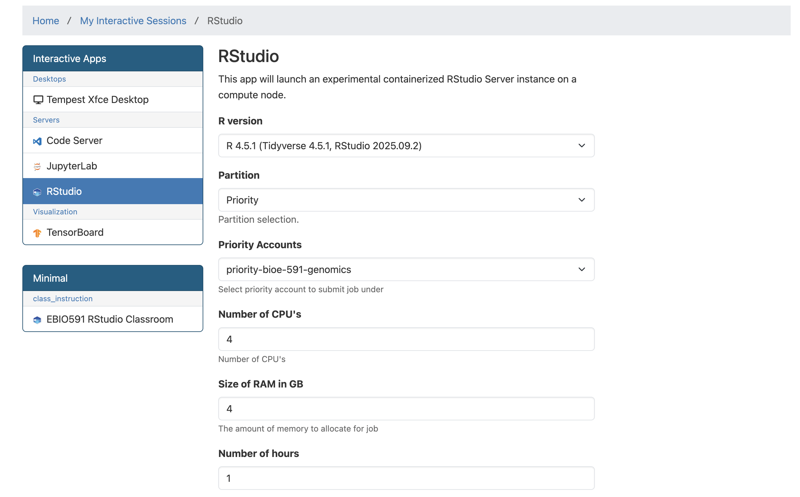

## Genome Scans with `pcadapt`

The combined impacts of natural selection, independent assortment and recombination leave distinct signatures in the genome. For example, genes under positive or negative selection---and regions in linkage disequilibrium with these genes---will show reduced or eliminated nucleotide diversity relative to other loci in population genomic data. If genes are under disruptive selection across populations, pairwise comparisons may reveal elevated metrics of differentiation or divergence (e.g., $F_{ST}$ and $D_{XY}$) relative to unlinked and neutral loci. When these metrics exceed a threshold of statistical significance relative to their genome-wide distribution of values, they can be classified *outlier loci*. Identifying outlier loci is often a first step in demonstrating local adaptation, and provides promising candidates for more detailed investigations into the drivers and consequences of hypothesized selection pressures (e.g., by exploring correlations with environmental variables).

Today's lab involves a simple application of one outlier locus detection method (`pcadapt`) to data from Meek et al. 2025's study of the genomic vulnerability of brook trout. In lieu of population genetic summary statistics, `pcadapt` first uses PCA to summarize the major axes of population structure in the genotype matrix. It then tests each SNP for an unusually strong association with those axes, relative to the genome-wide background. SNPs with exceptionally large loadings across the retained PCs are flagged as candidate outliers. The program is widely used and provides [a helpful vignette](https://bcm-uga.github.io/pcadapt/articles/pcadapt.html) you should review; as usual, the minimal working example provided below should serve as an introduction to the tool, not a complete recipe.

A `.vcf` and associated metadata from Meek et al. 2025 can be found in a new subdirectory in the usual location (`bioe-591-genomics/course-materials/data/selection/`). We will again use the Tempest Web portal, this time launching an interactive session with the latest version of `RStudio`:



Once initiated, connect to the server and start a new `R` or `R Markdown` script saved to your personal subdirectory. (In either case, code must be commented and results interpreted for homework.) We will begin by installing `pcadapt` and then loading it along with other relevant libraries (all of which should already be accessible to you): 

```{r, message=FALSE, warning=FALSE}
# install.packages("pcadapt")
# install.packages("patchwork")
# intsall.packages("viridis")
library(pcadapt)
library(vcfR)
library(adegenet)
library(ggplot2)
library(dplyr)
library(readr)
library(patchwork)
library(viridis)
```

After loading a `.csv` with the study's metadata, we can read in our `.vcf` using `pcadapt` directly, saving it to an object with a name of our choosing (here, `x`). The next line of code is the program's core function, performing principal component analysis and then looking for outliers relative to the first `K` principal components (note that this is *not* necessarily analogous to the number of populations in your data). To select the optimal number of PC axes, we can produce a screen plot to explore the change in the proportion of variance retained with each additional axis, looking for the point where the change in variance begins to flatten: 

```{r, message=FALSE, warning=FALSE}
meta <- read_csv("data/metadata.csv")
x <- read.pcadapt("data/salvelinus.vcf", type = "vcf")
pca <- pcadapt(x, K = 20)
plot(pca, option = "screeplot")
```

Here, there is no obvious candidate; we will follow Meek et al. 2025 in choosing `K=4` for outlier detection, where an "elbow is visible": 

```{r, message=FALSE, warning=FALSE}
pca_4 <- pcadapt(x, K = 4)
```

We then identify outliers using the `pvalues` vector of the `padj` object. Because we are simultaneously testing thousands of SNPs, we need to correct for multiple comparisons to reduce the rate of false positives (also known as the false discovery rate, or FDR). The `p.adjust()` function includes many approaches to this; we will implement a conservative approach known as a Bonferroni correction ($\frac{\alpha}{n}$, where $\alpha$ is the original significance level and $n$ is the number of comparisons). We can then subset the adjusted $p$-values into vectors that exceed or don't exceed this threshold, and print their length to the console:  
 
```{r, message=FALSE, warning=FALSE}
alpha <- 0.05
padj <- p.adjust(pca_4$pvalues, method = "bonferroni")
outlier_idx <- which(padj < alpha)
neutral_idx <- which(padj >= alpha)
cat("Outlier loci:", length(outlier_idx), "\n")
cat("Neutral loci:", length(neutral_idx), "\n")
```

We can look at the distribution of these outliers relative to their order in the `.vcf` with the `plot()` function: 

```{r, message=FALSE, warning=FALSE}
plot(pca_4)
```

Our next step is to explore the relationship of these outliers to inferred patterns of variation across populations and proxies for climate such as latitude. To do so, we will return to `adegenet`'s implementation of PCA, which is more flexible and transparent. This requires reloading our `.vcf` with `vcfR`, and then subsetting it by the index of outliers we created above: 

```{r, message=FALSE, warning=FALSE}
vcf <- read.vcfR("data/salvelinus.vcf", verbose = FALSE)
vcf_neutral <- vcf[neutral_idx, ]
vcf_outlier <- vcf[outlier_idx, ]
```

These neutral and outlier SNP sets need to be converted to `genind` objects (with `DNAbin` objects as a necessary intermediate step):

```{r, message=FALSE, warning=FALSE}
dna_neutral <- vcfR2DNAbin(vcf_neutral, unphased_as_NA = FALSE, consensus = TRUE, extract.haps = FALSE)
gi_neutral <- DNAbin2genind(dna_neutral)
dna_outlier <- vcfR2DNAbin(vcf_outlier, unphased_as_NA = FALSE, consensus = TRUE, extract.haps = FALSE)
gi_outlier <- DNAbin2genind(dna_outlier)
```

As we did two weeks ago, we'll need to scale our genotypes prior to running PCA with `prcomp()`: 

```{r, message=FALSE, warning=FALSE}
gi_neutral_scaled <- scaleGen(gi_neutral, NA.method = "mean", scale = FALSE)
pca_neutral <- prcomp(gi_neutral_scaled, center = FALSE, scale. = FALSE)
gi_outlier_scaled <- scaleGen(gi_outlier, NA.method = "mean", scale = FALSE)
pca_outlier <- prcomp(gi_outlier_scaled, center = FALSE, scale. = FALSE)
```

We now must transform our PCA objects (of type `double`) into dataframes for plotting. We'll do this by extracting the first two PC axes from each, making rownames into a column labeled `sample`, and joining these to our metadata object (`meta`) by aligning sample names. We'll also create axes that span the range of PC values from both datasets, and extract the percentage of variation they explain: 

```{r, message=FALSE, warning=FALSE}
# turn lists into dataframes
neutral_df <- data.frame(pca_neutral$x[, 1:2]) %>%
  mutate(sample = rownames(.))
outlier_df <- data.frame(pca_outlier$x[, 1:2]) %>%
  mutate(sample = rownames(.))

# join metadata
neutral_df <- left_join(neutral_df, meta, by = c("sample" = "Sample.ID"))
outlier_df <- left_join(outlier_df, meta, by = c("sample" = "Sample.ID"))

# shared axis limits
xlims <- range(c(outlier_df$PC1, neutral_df$PC1), na.rm = TRUE)
ylims <- range(c(outlier_df$PC2, neutral_df$PC2), na.rm = TRUE)

# percent variance explained
neutral_var <- 100 * summary(pca_neutral)$importance[2, ]
outlier_var <- 100 * summary(pca_outlier)$importance[2, ]
```

Lastly, we'll compare PCA plots between the two subsets of our data using `ggplot` and `patchwork`. Additional plotting and interpretation will be left for the (brief) homework assignment described below. 

```{r, message=FALSE, warning=FALSE}
p1 <- ggplot(neutral_df, aes(x = PC1, y = PC2, color=Site.Latitude)) +
  geom_point(size = 2, alpha = 0.8) +
  scale_color_viridis() +
  coord_cartesian(xlim = xlims, ylim = ylims) +
  theme_classic() +
  theme(legend.position = "bottom") +
  labs(
    title = "PCA: neutral loci",
    x = paste0("PC1 (", round(neutral_var[1], 1), "%)"),
    y = paste0("PC2 (", round(neutral_var[2], 1), "%)")
  ) 

p2 <- ggplot(outlier_df, aes(x = PC1, y = PC2, color=Site.Latitude)) +
  geom_point(size = 2, alpha = 0.8) +
  scale_color_viridis() +
  coord_cartesian(xlim = xlims, ylim = ylims) +
  theme_classic() +
  theme(legend.position = "bottom") +
  labs(
    title = "PCA: outlier loci only",
    x = paste0("PC1 (", round(outlier_var[1], 1), "%)"),
    y = paste0("PC2 (", round(outlier_var[2], 1), "%)")
  )

p1 + p2
```

:::{.callout-note title="**Homework 12**"}

In addition to working through the tutorial above in a standalone script or `.Rmd` file, Homework 12 requires you to complete the following: 

- Add commented text or a Markdown chunk below the PCA plot comparison with your interpretation of the differences between results from neutral loci and outlier loci. 
- Plot both PC1 and PC2 for both datasets against latitude. In a comment or Markdown chunk, describe your results. 
- Plot PC1 and PC2 for both datasets against *longitude*, again adding text to describe your results. 

When finished, add, commit, and push your script and any auxiliary content (e.g., `.png` files containing figures you may have generated) to GitHub. 

:::